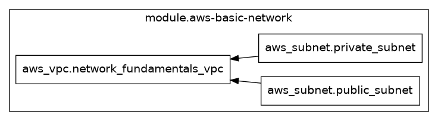

# exp-net-fundamentals-2025-q2

<!-- BEGIN_TF_DOCS -->
## Infrastructure Diagram


## Usage

```hcl
module "aws-basic-network" {
  // source
  source = "./modules/aws-basic-network"
  // variables
  availability_zone   = ["ca-central-1a", "ca-central-1b", "ca-central-1c"]
  aws_region          = "ca-central-1"
  environment_name    = "Networking Fundatamental Bootcamp"
  private_subnet_cidr = ["10.10.21.0/24", "10.10.22.0/24", "10.10.23.0/24"]
  public_subnet_cidr  = ["10.10.11.0/24", "10.10.12.0/24", "10.10.13.0/24"]
  tags = {
    "Owner"          = "ExamPro.co",
    "BoundedContext" = "Network Fundatmentals Bootcamp"
    "ManagedBy"      = "Terraform"
    "Environment"    = "Staging"
    "Region"         = "ca-central-1"
  }
  vpc_cidr = "10.0.0.0/16"
}
// AWS Variables

variable "availability_zone" {
  description = "Availability Zone"
  type        = list(string)
  default     = ["ca-central-1a", "ca-central-1b", "ca-central-1c"]
}

variable "aws_region" {
  description = "AWS Region"
  type        = string
  default     = "ca-central-1"
}

variable "environment_name" {
  description = "Name of the environment"
  type        = string
  default     = "Networking Fundatamental Bootcamp"
}

variable "private_subnet_cidr" {
  description = "CIDR for Private Subnet"
  type        = list(string)
  default     = ["10.10.21.0/24", "10.10.22.0/24", "10.10.23.0/24"]
}

variable "public_subnet_cidr" {
  description = "CIDR for Public Subnet"
  type        = list(string)
  default     = ["10.10.11.0/24", "10.10.12.0/24", "10.10.13.0/24"]
}

variable "tags" {
  description = ""
  type        = map(string)
  default = {
    "Owner"          = "ExamPro.co",
    "BoundedContext" = "Network Fundatmentals Bootcamp"
    "ManagedBy"      = "Terraform"
    "Environment"    = "Staging"
    "Region"         = "ca-central-1"
  }
}

variable "vpc_cidr" {
  description = "CIDR for VPC"
  type        = string
  default     = "10.0.0.0/16"
}
```

## Requirements

| Name | Version |
|------|---------|
| <a name="requirement_aws"></a> [aws](#requirement\_aws) | 6.0.0-beta2 |

## Providers

No providers.

## Modules

| Name | Source | Version |
|------|--------|---------|
| <a name="module_aws-basic-network"></a> [aws-basic-network](#module\_aws-basic-network) | ./modules/aws-basic-network | n/a |

## Resources

No resources.

## Inputs

| Name | Description | Type | Default | Required |
|------|-------------|------|---------|:--------:|
| <a name="input_availability_zone"></a> [availability\_zone](#input\_availability\_zone) | Availability Zone | `list(string)` | <pre>[<br/>  "ca-central-1a",<br/>  "ca-central-1b",<br/>  "ca-central-1c"<br/>]</pre> | no |
| <a name="input_aws_region"></a> [aws\_region](#input\_aws\_region) | AWS Region | `string` | `"ca-central-1"` | no |
| <a name="input_environment_name"></a> [environment\_name](#input\_environment\_name) | Name of the environment | `string` | `"Networking Fundatamental Bootcamp"` | no |
| <a name="input_private_subnet_cidr"></a> [private\_subnet\_cidr](#input\_private\_subnet\_cidr) | CIDR for Private Subnet | `list(string)` | <pre>[<br/>  "10.10.21.0/24",<br/>  "10.10.22.0/24",<br/>  "10.10.23.0/24"<br/>]</pre> | no |
| <a name="input_public_subnet_cidr"></a> [public\_subnet\_cidr](#input\_public\_subnet\_cidr) | CIDR for Public Subnet | `list(string)` | <pre>[<br/>  "10.10.11.0/24",<br/>  "10.10.12.0/24",<br/>  "10.10.13.0/24"<br/>]</pre> | no |
| <a name="input_tags"></a> [tags](#input\_tags) | n/a | `map(string)` | <pre>{<br/>  "BoundedContext": "Network Fundatmentals Bootcamp",<br/>  "Environment": "Staging",<br/>  "ManagedBy": "Terraform",<br/>  "Owner": "ExamPro.co",<br/>  "Region": "ca-central-1"<br/>}</pre> | no |
| <a name="input_vpc_cidr"></a> [vpc\_cidr](#input\_vpc\_cidr) | CIDR for VPC | `string` | `"10.0.0.0/16"` | no |

## Outputs

No outputs.

<!-- END_TF_DOCS -->